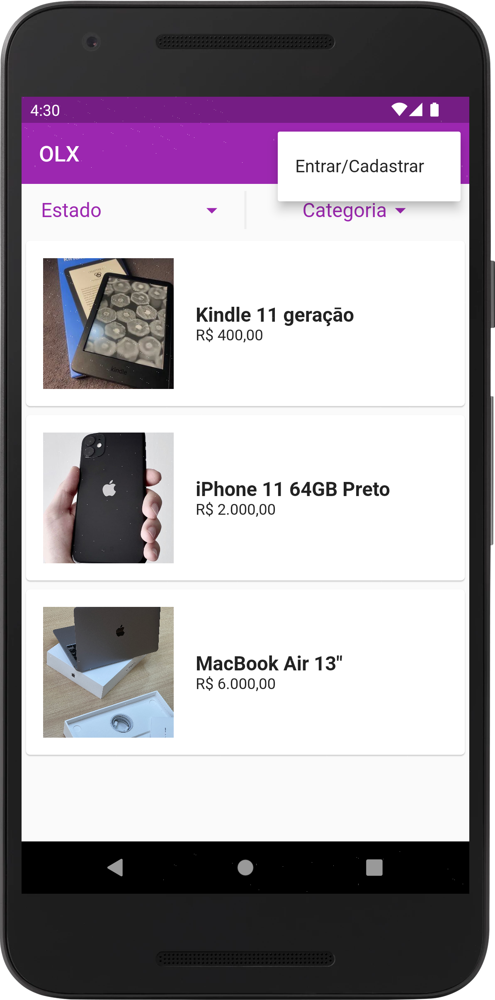
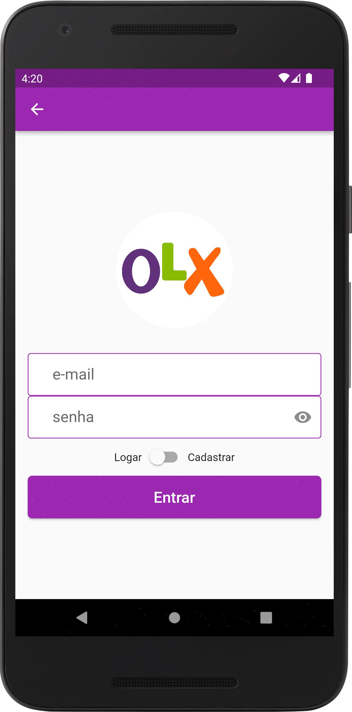
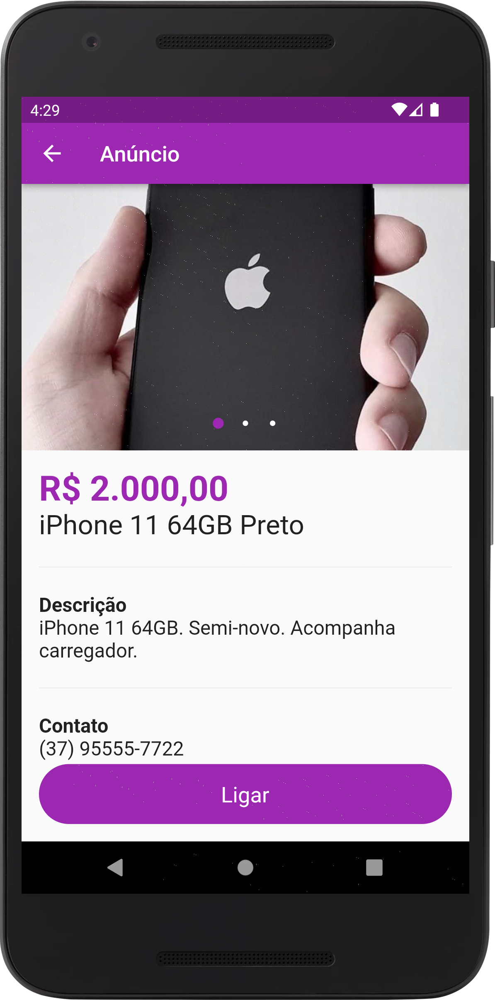
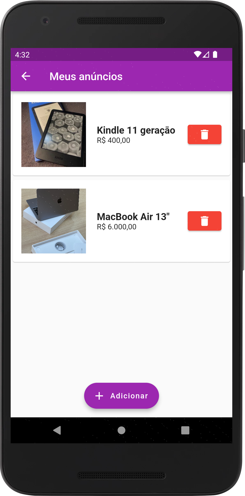
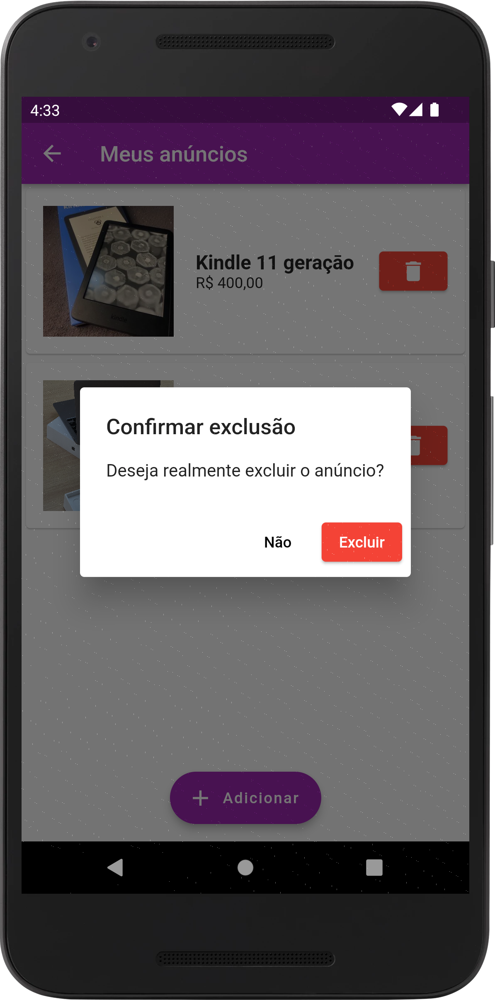

# OLX

Clone da loja virtual OLX. Feito em Flutter.

Autor: Guilherme Reis - [LinkedIn](https://www.linkedin.com/in/guilhermereisdev/)

### Sistemas disponíveis
✅ Android | ✅ iOS

### Recursos do app

- Exibe os produtos à venda de todos os usuários (mesmo sem o usuário atual estar logado).
- Permite filtrar os produtos por estado e categoria.
- Permite criação de conta para acesso.
- Usuário pode gerenciar cadastrando/excluindo os próprios produtos que quiser vender.
- No cadastro de produtos para venda é possível incluir fotos, descrição, categoria, preço, telefone para contato e estado onde o vendedor mora.

### Técnicas utilizadas

- [Firebase Auth](https://pub.dev/packages/firebase_auth) para gerir o cadastro dos usuários.
- [Firebase Storage](https://pub.dev/packages/firebase_storage) para armazenar as imagens dos produtos à venda.
- [Cloud Firestore](https://pub.dev/packages/cloud_firestore) para armazenar dados dos usuários.
- [Image Picker](https://pub.dev/packages/image_picker) para permitir o usuário selecionar imagens na galeria.
- [Brasil Fields](https://pub.dev/packages/brasil_fields) para utilizar padrões e formatos da moeda brasileira.
- [Form Field Validator](https://pub.dev/packages/form_field_validator) para validar campos de formulários.
- [Carousel Pro Nullsafety](https://pub.dev/packages/carousel_pro_nullsafety) para gerir o carrosel de imagens dos produtos.
- [URL Launcher](https://pub.dev/packages/url_launcher) para fazer ligações para o dono do produto.

### Telas

_Clique na imagem para ver em tela cheia_

   
   
